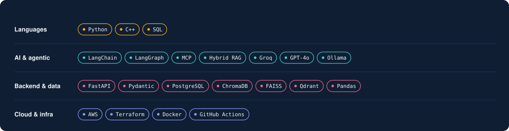

<!-- Profile README for github.com/aditya-ahlawat-2508
     Assets live in ./assets. Regenerate them with gen.py if you change copy. -->

  

### "Sounds plausible" isn't good enough.

An agent that quotes a flight fare has to quote the real one. A meeting point has to be fair to the friend who lives furthest away. That's the thread through everything below — TripMate was inventing fares with total confidence until I tested it adversarially, and the meeting-point finder exists because "fastest for most people" and "fair to everyone" are usually different answers.

  
  
  
  

  

  

### GitHub, in numbers

  
  

  

### LeetCode

  

### Let's connect

| | |
|---|---|
| **LinkedIn** | [linkedin.com/in/aditya-2503-](https://www.linkedin.com/in/aditya-2503-/) |
| **Email** | [adityaahlawat544@gmail.com](mailto:adityaahlawat544@gmail.com) |
| **LeetCode** | [Aditya1Ahlawat](https://leetcode.com/u/Aditya1Ahlawat/) |
| **Portfolio** | [portfolio-taupe-eta-26.vercel.app](https://portfolio-taupe-eta-26.vercel.app/) |

Open to SDE and AI/ML roles for 2027 