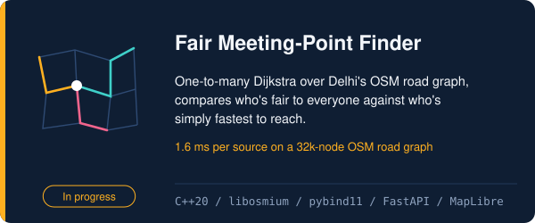
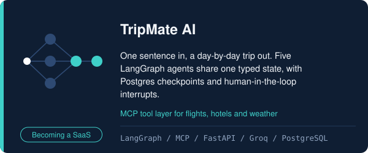
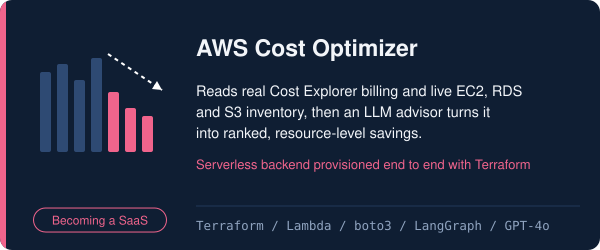
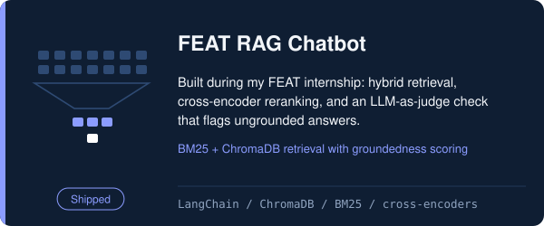
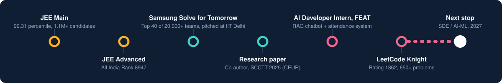

<!-- Profile README for github.com/aditya-ahlawat-2508
     Assets live in ./assets. Regenerate them with gen.py if you change copy.
     TODO: replace every YOUR-... link before committing. -->

  

I like problems where "sounds plausible" isn't good enough: an agent that quotes a fare has to quote the real one, and a meeting point has to be fair to the friend who lives furthest away. Right now I'm writing a C++20 routing engine for that second problem, and turning TripMate and my AWS Cost Optimizer into real products people can sign up for.

  
  
  
  

  

**Tools I reach for.** Python and C++ first, SQL when the data matters. LangGraph, LangChain and MCP for agents; hybrid search (BM25 + vectors) and cross-encoders for retrieval. FastAPI, Pydantic and PostgreSQL on the backend. AWS, Terraform, Docker and GitHub Actions to ship it.

**Say hello.** I'm open to SDE and AI/ML roles for 2027. If you're building something where an LLM has to be right rather than just fluent, I'd like to hear about it.

[LinkedIn](https://www.linkedin.com/in/aditya-2503-/) · [LeetCode](https://leetcode.com/u/Aditya1Ahlawat/) · [Portfolio](https://portfolio-taupe-eta-26.vercel.app/) · [adityaahlawat544@gmail.com](mailto:adityaahlawat544@gmail.com)
